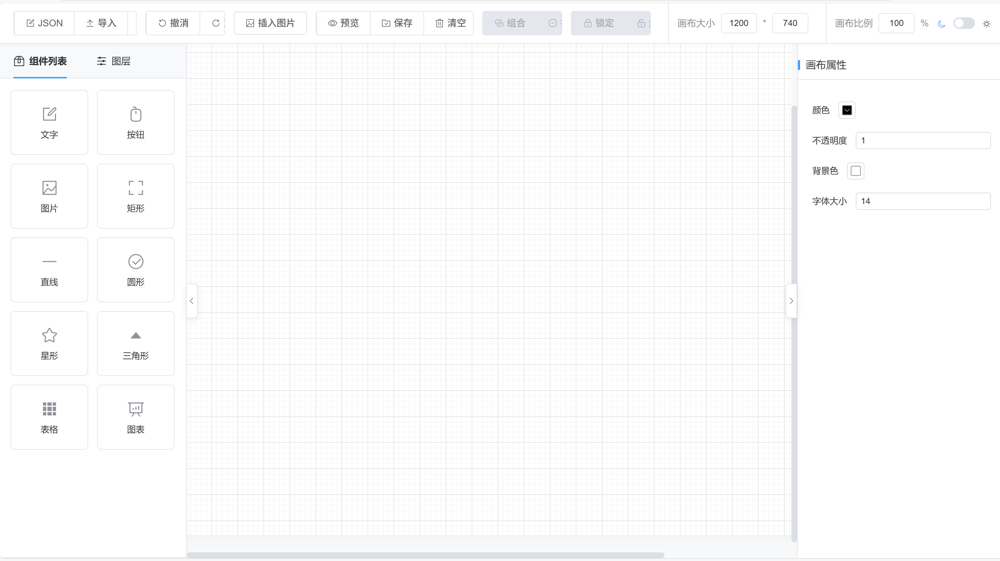

# Vue3 Visual Drag Platform (Visual Drag Demo)

<p align="center">
  
  
  
  
  
</p>

> 🚀 一个基于 **Vue 3** + **Vite** + **Pinia** 的高性能低代码可视化拖拽平台。支持通过简单的拖拉拽操作快速构建网页原型，并集成了丰富的交互能力。

---

## ✨ 功能特性

本项目深度还原了可视化编辑器的核心交互逻辑，具有以下核心功能：

| 模块 | 功能点 |
| --- | --- |
| **核心编辑器** | 无限画布、SVG 动态网格、实时预览、自动吸附、标线对齐、撤销重做 (Snapshot) |
| **基础组件库** | 文本、图片、矩形、圆形、直线、五角星、三角形、按钮、多功能表格 |
| **高级组件** | ECharts 动态图表、组合组件 (Group)、SVG 图形支持 |
| **交互能力** | 拖拽位移、八点缩放、旋转控制、层级调整 (置顶/置底)、锁定/解锁 |
| **属性管理** | 实时样式编辑、不透明度、颜色选择器、字体配置、组件联动、接口请求绑定 |
| **进阶交互** | 动画系统 (基于 Animate.css)、事件绑定 (跳转/脚本执行)、右键上下文菜单 |

## 🖥️ 预览



---

## 🛠️ 技术栈

| 技术 | 作用 |
| --- | --- |
| **Vue 3** | 核心框架，使用 Composition API (Script Setup) 开发 |
| **Vite 5** | 下一代构建工具，极速的热更新体验 |
| **Pinia** | 状态管理，负责画布数据、组件状态及快照恢复 |
| **Element Plus** | 基础 UI 组件库，用于属性面板和侧边栏 |
| **ECharts** | 数据可视化支持 |
| **Ace Editor** | 内置代码编辑器，支持 JSON 数据的实时查看与编辑 |
| **Animate.css** | 提供丰富的预置动画效果 |

---

## 📖 技术原理解析

如果你对实现原理感兴趣，可以参考作者撰写的系列技术文章：

- [可视化拖拽组件库一些技术要点原理分析](https://github.com/woai3c/Front-end-articles/issues/19)
- [可视化拖拽组件库一些技术要点原理分析（二）](https://github.com/woai3c/Front-end-articles/issues/20)
- [可视化拖拽组件库一些技术要点原理分析（三）](https://github.com/woai3c/Front-end-articles/issues/21)
- [可视化拖拽组件库一些技术要点原理分析（四）](https://github.com/woai3c/Front-end-articles/issues/33)
- [低代码与大语言模型的探索实践](https://github.com/woai3c/Front-end-articles/issues/45)

---

## 🚀 快速开始

### 1. 环境准备
确保你的本地环境满足以下要求：
- **Node.js** >= 16.0.0
- **npm** >= 7.0.0 (或 pnpm / yarn)

### 2. 获取代码并安装依赖
```bash
git clone https://github.com/woai3c/visual-drag-demo.git
cd visual-drag-demo
npm install
```

### 3. 本地开发
```bash
npm run dev
```
访问 `http://localhost:3000` 即可开始编辑。

### 4. 生产构建
```bash
npm run build
```

---

## 📁 项目结构

```text
src/
├── components/          # 编辑器核心 UI
│   ├── Editor/          # 画布渲染引擎 (Grid, Shape, MarkLine, ContextMenu)
│   ├── Toolbar/         # 顶部工具栏 (保存、预览、撤销、重做等)
│   └── ...              # 属性面板、列表组件等
├── custom-component/    # 具体的低代码组件实现
│   ├── VText.vue        # 文本组件
│   ├── VButton.vue      # 按钮组件
│   └── common/          # 组件通用配置项
├── store/               # 状态管理 (Canvas Data, Snapshots, Editor State)
├── styles/              # 全局样式与暗黑模式配置
├── utils/               # 工具函数 (ID 生成、样式计算、事件监听)
└── views/               # 主页面入口
```

---

## 📄 开源协议

本项目基于 [MIT](LICENSE) 协议开源。
